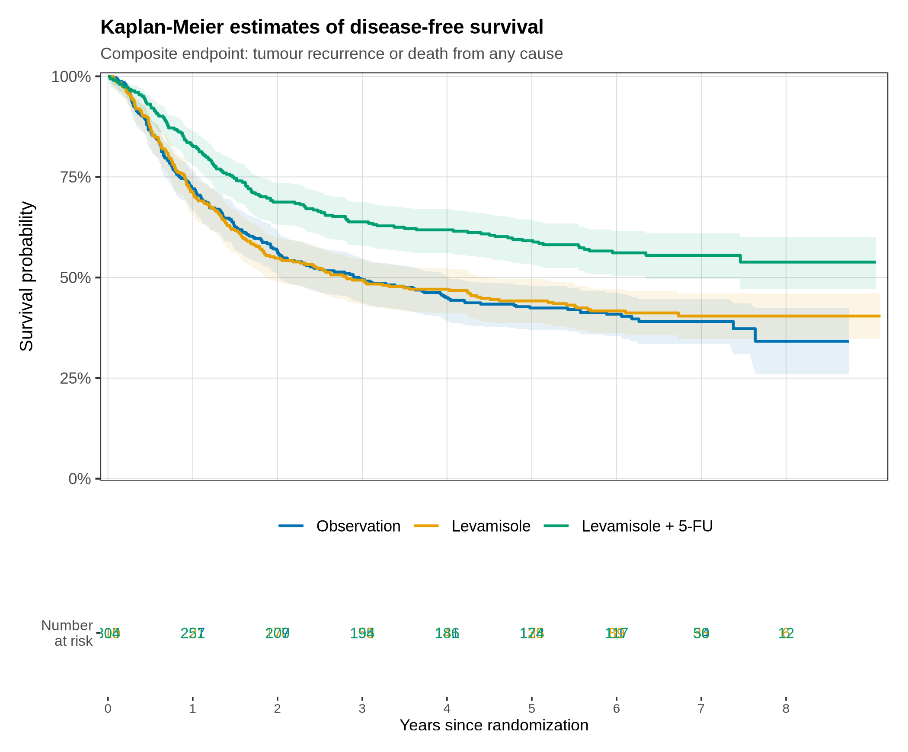
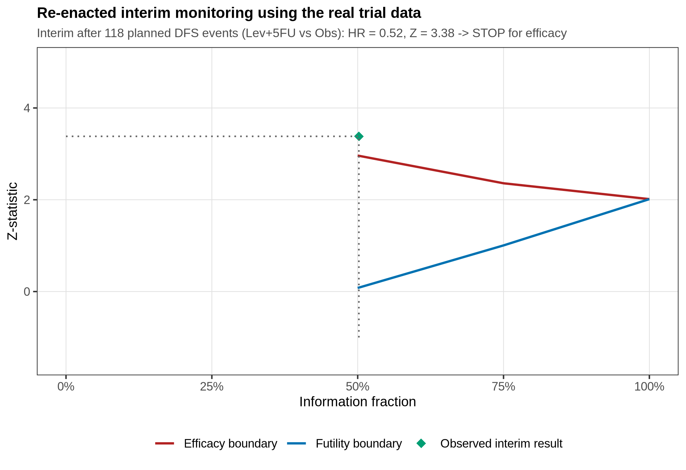
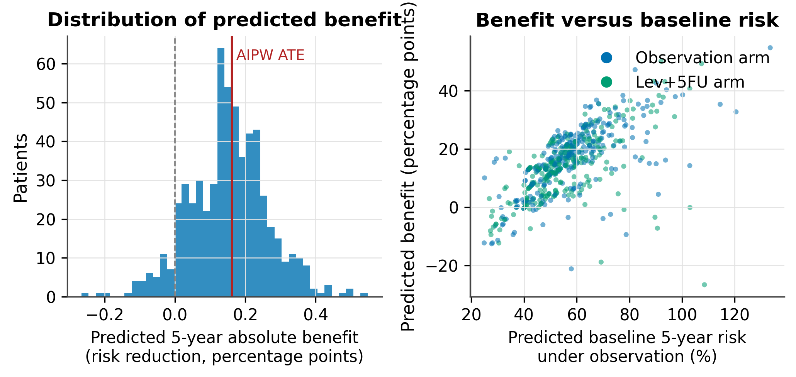

# A Modern Biostatistical Re-analysis of the NCCTG Adjuvant Colon Cancer Randomized Trial

**Frequentist, Bayesian, and Machine Learning Perspectives on a Landmark Oncology Trial**

**Author:** Cathy
**Project type:** Master of Science (Biostatistics) capstone project
**Languages:** R 4.5.3 and Python 3.12
**Date:** September 2026

---

## Abstract

This project presents a comprehensive, fully reproducible re-analysis of a
landmark adjuvant colon cancer randomized trial (n = 929; observation vs
levamisole vs levamisole + 5-fluorouracil) using the individual patient data
distributed with the R `survival` package. The primary endpoint is a composite
disease-free survival (DFS) outcome (tumour recurrence or death from any
cause; 506 events), and the secondary endpoint is overall survival (452
deaths). The analysis integrates four complementary statistical paradigms in a
single coherent pipeline: (i) classical frequentist inference (Kaplan-Meier
estimation, log-rank tests, covariate-adjusted Cox models with multiple
imputation, proportional-hazards diagnostics, and competing-risk sensitivity
analyses); (ii) modern trial design (sample-size calculation, an
O'Brien-Fleming group-sequential design with beta-spending futility
boundaries, and a data-driven re-enactment of interim monitoring on the real
trial data); (iii) Monte Carlo simulation studies quantifying the efficiency
of covariate adjustment, the operating characteristics of the group-sequential
design, and the coverage of Wald and bootstrap confidence intervals under
non-proportional hazards; and (iv) machine-learning and Bayesian methods
(cross-validated survival prediction with penalized, ensemble, and boosted
models; a Weibull proportional-hazards Bayesian analysis with prior
sensitivity and sequential monitoring; and doubly robust AIPW estimation of heterogeneous absolute treatment effects). A
newly added restricted-mean-survival-time (RMST) module quantifies the
benefit in absolute time units (0.63 disease-free years gained within 5
years), a collapsible estimand that requires no proportional-hazards
assumption. The re-analysis confirms a
substantial and robust treatment benefit of levamisole + 5-FU (adjusted HR =
0.62, 95% CI 0.50-0.77; 5-year DFS 59.2% vs 42.4%; NNT = 6), demonstrates
that a modern group-sequential design would likely have stopped the trial
early for efficacy (interim Z = 3.38 after 118 events), and shows that
Bayesian monitoring would have signalled benefit even earlier. All code,
outputs, and this report are reproducible end-to-end from this repository.

---

## 1. Background and Objectives

Adjuvant chemotherapy for resected stage B/C colon cancer was one of the
great success stories of 1980s oncology. The North Central Cancer Treatment
Group program (Laurie et al. 1989; Moertel et al. 1990) established that the
combination of levamisole and 5-fluorouracil substantially reduces recurrence
after curative resection, and the individual patient data from this trial
have since become one of the most widely used teaching datasets in survival
analysis, distributed with the R `survival` package (Therneau 2024).

This project asks: **what can a modern biostatistician extract from this
trial today?** The objectives are:

1. **Re-estimate the treatment effects** with contemporary methodology:
   covariate-adjusted Cox models with multiple imputation, robust variance
   estimation, absolute-benefit measures (risk differences, NNT), and
   competing-risk sensitivity analyses that handle deaths without recurrence
   explicitly, and absolute-benefit summaries in both percentage points
   (risk differences, NNT) and time units (restricted mean survival time).
2. **Redesign the trial** as it would be designed today: formal sample-size
   calculation for a target hazard ratio, a group-sequential design with
   alpha- and beta-spending, and a re-enactment of interim monitoring using
   the real event times — asking whether the trial would have stopped early.
3. **Quantify operating characteristics by simulation**, including the
   efficiency gains from covariate adjustment (a topic of active regulatory
   interest), type-I-error control of the sequential design, and confidence
   interval coverage under proportional-hazards violation.
4. **Predict prognosis with machine learning** and validate predictions
   honestly with repeated cross-validation, time-dependent discrimination,
   integrated Brier scores, and calibration.
5. **Re-analyze the evidence Bayesianly**, with explicit prior sensitivity
   (skeptical, weakly-informative, enthusiastic) and sequential monitoring
   posteriors, contrasting the paradigm with frequentist interim analyses.
6. **Characterize treatment-effect heterogeneity** in absolute terms using
   jackknife pseudo-observations, cross-fitted G-computation, and doubly
   robust AIPW estimation.

7. **Re-express the treatment benefit in time units** with the restricted
   mean survival time (RMST): horizon-specific differences and ratios with
   bootstrap CIs, a covariate-adjusted pseudo-observation regression, and
   stratified analyses within proportional-hazards violators - a
   collapsible counterpart to the non-collapsible hazard ratio.

## 2. Data

| Item | Description |
|---|---|
| Source | `survival::colon` (NCCTG adjuvant colon cancer trial), obtained as CSV from the Rdatasets mirror and stored in `data/raw/colon.csv` |
| Patients | 929 patients with resected stage B/C colon carcinoma, randomized 1:1:1 to Observation (n=315), Levamisole (n=310), or Levamisole + 5-FU (n=304); a single study (`study = 1`) |
| Baseline covariates | age, sex, obstruction, perforation, adherence to nearby organs, number of positive lymph nodes, tumour differentiation, extent of local spread, surgery-to-registration interval |
| Endpoints | Composite disease-free survival (recurrence or death, 506 events) - primary; overall survival (452 deaths) - secondary; recurrence with death-without-recurrence as a competing event (38 competing events) - sensitivity |
| Missing data | positive nodes 18 (1.9%), differentiation 23 (2.5%); 95.6% complete cases |
| Follow-up | median 6.4 years (reverse Kaplan-Meier); maximum 9.1 years |

The raw `etype = 1` records time to recurrence with death treated as
censoring. Because current adjuvant-trial conventions define DFS as
recurrence **or** death, the data-curation module constructs the composite
endpoint explicitly and retains the competing-risk coding for sensitivity
analyses (Aalen-Johansen and Fine-Gray). See `docs/codebook.md` for the
complete data dictionary.

## 3. Methods and Pipeline

The analysis is organized as six R modules (frequentist workflow, design,
simulation) and three Python modules (machine learning, Bayesian inference,
heterogeneity). All scripts are deterministic (fixed seeds) and communicate
only through files in `data/` and `outputs/`.

| Module | Language | Purpose | Key methods |
|---|---|---|---|
| `R/01_data_curation.R` | R | Import, QC, endpoint construction, imputation | integrity checks, composite DFS, `mice` (m=20) with Nelson-Aalen predictors (White-Royston) |
| `R/02_descriptive.R` | R | Table 1 and balance diagnostics | chi-square/Fisher/ANOVA/Kruskal-Wallis, pairwise standardized mean differences |
| `R/03_frequentist_analysis.R` | R | Primary and secondary efficacy analysis | Kaplan-Meier with risk tables, log-rank, Cox (unadjusted, adjusted CC, adjusted MI pooled by Rubin's rules), `cox.zph`, 5-year absolute benefit with bootstrap CIs, Aalen-Johansen CIF, Fine-Gray, spline sensitivity |
| `R/04_subgroup_analysis.R` | R | Pre-specified subgroups | subgroup-specific Cox models, interaction tests, forest plot |
| `R/05_trial_design.R` | R | Modern redesign of the trial | `gsDesign::nSurv`, 3-look group-sequential design (O'Brien-Fleming efficacy, Hwang-Shih-DeCani non-binding futility), boundary visualization, conditional power re-enactment on real data |
| `R/06_simulation_study.R` | R | Monte Carlo simulation studies | (A) covariate-adjustment efficiency: power/SE/type-I across prognostic strength; (B) simulated operating characteristics of the sequential design; (C) Wald vs bootstrap CI coverage under time-varying hazard ratios |
| `python/02_machine_learning.py` | Python | Prognostic prediction | clinical Cox, elastic-net Cox, random survival forest, gradient boosting (Cox loss), XGBoost (Cox objective); 5x5-fold stratified CV; C-index, IPCW AUC at 5 years, integrated Brier score; calibration by risk deciles; permutation importance |
| `python/03_bayesian_analysis.py` | Python | Bayesian re-analysis | Weibull PH model with `pm.Censored` right-censoring; skeptical / weakly-informative / enthusiastic priors; event-driven sequential monitoring; posterior predictive checks; LOO model comparison (Weibull vs exponential) |
| `python/04_cate_heterogeneity.py` | Python | Heterogeneous treatment effects | jackknife pseudo-observations for 5-year risk; cross-fitted G-computation and AIPW with influence-function SEs; cross-fitted T-learner (LASSO) for CATE; benefit-by-risk analysis |
| `python/05_rmst_analysis.py` | Python | Restricted mean survival time | KM-based RMST at horizons 3-8 years (difference and ratio, percentile bootstrap CIs); covariate-adjusted RMST via pseudo-observation regression; RMST within the obstruction stratum (strongest PH violation) |
| `python/06_figure_rebuilds.py` | Python | Publication-grade report figures | matplotlib rebuilds (from the analysis data and saved tables) of the figures whose original ggplot renderings had layout defects: KM curves with one-row-per-arm risk tables, subgroup forest plot, Schoenfeld diagnostics, Simulation A power bars, and the Aalen-Johansen vs naive cumulative-incidence figure; validations are printed against the reference tables and the report text |

## 4. Key Results

### 4.1 Treatment effects are robust across every paradigm

| Analysis | Estimate | 95% interval |
|---|---|---|
| Unadjusted Cox (DFS) | HR 0.623 | 0.499-0.777 |
| Adjusted Cox, multiple imputation | HR 0.621 | 0.496-0.776 |
| Fine-Gray subdistribution (recurrence) | sHR 0.596 | 0.469-0.756 |
| Bayesian Weibull, skeptical prior | HR 0.610 | 0.485-0.757 |
| Bayesian Weibull, weakly-informative | HR 0.591 | 0.466-0.738 |
| Bayesian Weibull, enthusiastic prior | HR 0.592 | 0.474-0.734 |

Absolute benefit at 5 years: DFS 59.2% (Lev+5FU) vs 42.4% (Observation);
risk difference -16.7 percentage points (bootstrap 95% CI -24.2 to -9.4),
NNT = 6. The AIPW doubly robust estimate of the 5-year risk difference is
-16.2 points (95% CI -23.9 to -8.5). The restricted mean survival time
analysis translates the same benefit into 0.63 disease-free years gained
within 5 years (95% CI 0.33-0.92), rising to 1.13 years by 8 years; the
covariate-adjusted pseudo-observation estimate (0.57 years) agrees
because the RMST difference is collapsible.



### 4.2 A modern design would have stopped the trial early

The redesigned 3-look group-sequential trial (target HR 0.65, 90% power,
one-sided alpha 0.025; 118/177/235 events) applied to the real event times
yields an interim result of HR = 0.52, Z = 3.38 at the first analysis —
**crossing the O'Brien-Fleming efficacy boundary (2.96)**. Conditional power
under the observed trend exceeds 99.8%. Bayesian monitoring with a skeptical
prior reports P(HR < 1) = 0.998 after only 25% of events (79 events).



### 4.3 Covariate adjustment buys power; the hazard ratio does not collapse

Simulation Study A shows that adjusting for trial-calibrated prognostic
covariates raises power from 72.6% to 80.9% for a moderate effect (HR 0.72)
without inflating type-I error, and that the unadjusted estimator targets a
marginal hazard ratio attenuated toward 1 — a direct demonstration of the
non-collapsibility of the hazard ratio.

### 4.4 Prognostic prediction: ensemble methods lead modestly

Random survival forests achieve the best cross-validated discrimination
(C = 0.646; 5-year AUC = 0.677; IBS = 0.217), ahead of the clinical Cox
model (C = 0.634); all models show an apparent-vs-CV gap (up to 0.12 for
XGBoost), underscoring the necessity of honest validation. The number of
positive lymph nodes dominates permutation importance, in agreement with
clinical knowledge.

### 4.5 Absolute benefit is concentrated where baseline risk is high

The CATE analysis predicts a 29-percentage-point average benefit in the
highest-risk quartile versus 1 point in the lowest, while observed
quartile-specific risk differences are statistically compatible with a
constant *relative* effect. Absolute-benefit heterogeneity in this trial is
therefore driven mainly by baseline risk rather than by qualitative effect
modification - a clinically important distinction for treatment decisions.



## 5. Repository Structure

```
.
├── README.md                     # this document
├── LICENSE                       # MIT (c) 2026 Cathy
├── Makefile                      # one-command reproduction of all results
├── data
│   ├── raw/colon.csv             # trial data as distributed (Rdatasets mirror)
│   └── processed/                # created by 01: analysis file + imputations
├── R                             # frequentist workflow, design, simulation
│   ├── 00_common.R
│   ├── 01_data_curation.R
│   ├── 02_descriptive.R
│   ├── 03_frequentist_analysis.R
│   ├── 04_subgroup_analysis.R
│   ├── 05_trial_design.R
│   └── 06_simulation_study.R
├── python                        # machine learning, Bayesian, heterogeneity, RMST
│   ├── 00_common.py
│   ├── 02_machine_learning.py
│   ├── 03_bayesian_analysis.py
│   ├── 04_cate_heterogeneity.py
│   └── 05_rmst_analysis.py
├── outputs
│   ├── figures/                  # all figures (vector PDF for reports, PNG for README)
│   └── tables/                   # all result tables as CSV
├── report                        # full project report (capstone format, PDF)
├── paper                         # arXiv-style preprint (main.tex, refs.bib, PDF)
├── docs
│   └── codebook.md               # data dictionary and provenance
└── environment                   # requirements.txt, R session info
```

## 6. Reproduction

### Requirements

- **R** 4.4+ with packages: `survival, mice, ggplot2, dplyr, tidyr, purrr,
  broom, patchwork, scales, gsDesign`
- **Python** 3.10+ with packages listed in `environment/requirements.txt`
  (`numpy, pandas, scikit-learn, matplotlib, lifelines, scikit-survival,
  xgboost, pymc, arviz`)

### Run everything

```bash
# from the repository root
make all          # runs R modules 01-06, then Python modules 02-05
```

or step by step:

```bash
Rscript R/01_data_curation.R
Rscript R/02_descriptive.R
Rscript R/03_frequentist_analysis.R
Rscript R/04_subgroup_analysis.R
Rscript R/05_trial_design.R
Rscript R/06_simulation_study.R      # ~8-12 minutes

python python/02_machine_learning.py
python python/03_bayesian_analysis.py
python python/04_cate_heterogeneity.py
python python/05_rmst_analysis.py
python python/06_figure_rebuilds.py  # authoritative source of the report figures
```

Reports are compiled with [Tectonic](https://tectonic-typesetting.github.io/)
from their respective directories:

```bash
(cd report && tectonic main.tex)   # full capstone report
(cd paper  && tectonic main.tex)   # arXiv-style preprint
```

All scripts use fixed seeds (global seed 20260916) and write only to
`data/processed/` and `outputs/`. Total runtime is approximately 20-25
minutes on a single core; the simulation module is the slowest component.

## 7. Session Information

See `environment/r_session_info.txt` for the full R session info and
`environment/python_package_versions.txt` for exact Python package versions
used to produce the committed outputs.

## 8. References

- Laurie JA, Moertel CG, Fleming TR, et al. Surgical adjuvant therapy of
  large-bowel carcinoma: an evaluation of levamisole and the combination of
  levamisole and fluorouracil. *J Clin Oncol* 1989;7:1447-1456.
- Moertel CG, Fleming TR, Macdonald JS, et al. Levamisole and fluorouracil
  for adjuvant therapy of resected colon carcinoma. *N Engl J Med*
  1990;322:352-358.
- Therneau TM. *A Package for Survival Analysis in R*. R package version
  3.8, 2024. https://CRAN.R-project.org/package=survival
- Rubin DB. *Multiple Imputation for Nonresponse in Surveys*. Wiley, 1987.
- White IR, Royston P. Imputing missing covariate values for the Cox model.
  *Stat Med* 2009;28:1982-1998.
- Fine JP, Gray RJ. A proportional hazards model for the subdistribution of a
  competing risk. *JASA* 1999;94:496-509.
- Lan KKG, DeMets DL. Discrete sequential boundaries for clinical trials.
  *Biometrika* 1983;70:659-663.
- Anderson KM, Lan KKG, DeMets DL. Discrete sequential boundaries for clinical
  trials. *Biometrika* 1983;70:659-663. (see also gsDesign documentation)
- Pocock SJ. Group sequential methods in the design and analysis of clinical
  trials. *Biometrika* 1977;64:191-199.
- Food and Drug Administration. *Adjusting for Covariates in Randomized
  Clinical Trials for Drugs and Biologics with Continuous Outcomes* -
  and the ICH E9(R1) estimands framework. 2021.
- Andersen PK, Klein JP, Rosthoj S. Generalised linear models for correlated
  pseudo-observations, with applications to multi-state models.
  *Biometrika* 2003;90:503-514.
- Hernan MA, Robins JM. *Causal Inference: What If*. Boca Raton: Chapman &
  Hall/CRC, 2020.
- Harrell FE Jr. *Regression Modeling Strategies*. 2nd ed. Springer, 2015.
- Gelman A, et al. *Bayesian Data Analysis*. 3rd ed. CRC Press, 2013.

## 9. Author and License

**Cathy** 

Released under the MIT License (see `LICENSE`). The trial data are
redistributed in good faith for research and educational use with full
attribution to the original investigators and the R `survival` package; if
you are the data owner and have concerns, please open an issue.
